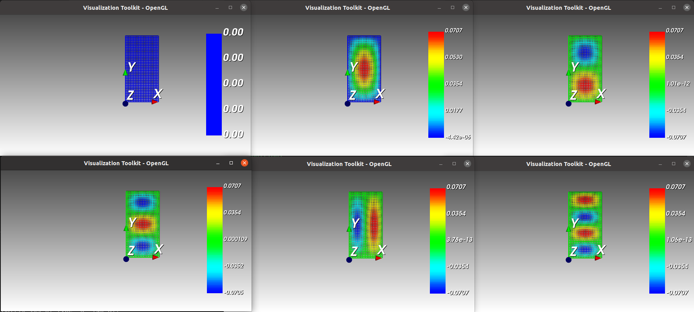

Eigenmodes of Helmholtz
=======================

*Shared by Antoine Rideau*

On this page you will find how to show using **Castor** the eigenmodes of the wave equation on a rectangle with fixed edges.

We start from the following D'Alembert equation on :math:`\Omega = \left [ 0, x_{0} \right ] \times \left [ 0, y_{0} \right ]` with Dirichlet boundary condition on :math:`\Gamma = \partial \Omega` 

.. math:: 

    \left\{\begin{matrix}
    - \displaystyle \frac{1}{c} \frac{\partial^2 u }{\partial t^2}(\mathbf{x}) + \Delta u (\mathbf{x}) = 0 & , & \mathbf{x} \in \Omega \setminus \Gamma
    \\ 
    u(\mathbf{x} , \cdot   ) = 0 & , & \mathbf{x} \in \Gamma 
    \end{matrix}\right.
    ,

considering

.. math::

    u (\mathbf{x},t) = V(\mathbf{x})e^{i \omega t} ,

gives the Helmholtz equation 

.. math::

    \left\{\begin{matrix}
    k^{2}V(\mathbf{x}) + \Delta V(\mathbf{x}) = 0 & , & \mathbf{x} \in \Omega \setminus \Gamma
   \\
   V(\mathbf{x}) = 0 & , & \mathbf{x} \in \Gamma
   \end{matrix}\right. 
    ,

| with :math:`k = \displaystyle \frac{\omega}{c}` .
| 
| The space domain ``L`` is discretized with ``dx`` steps which results in the meshgrid described by ``X`` and ``Y`` 

.. math:: 

    \begin{matrix} x_{i} = i \delta x & \text{ for } i = \left [ \! \left [ 0, n_{x}-1 \right ] \! \right ]\\ y_{j} = j \delta x & \text{ for } j = \left [ \! \left [ 0, n_{y}-1 \right ] \! \right ] \end{matrix}

.. code-block:: c++

    // Parameters
    matrix<> L = {1, 2}; // Dimensions
    double dx = 0.05;    // Space discretization

    // Discretization
    matrix<> X, Y;
    std::tie(X, Y) = meshgrid(colon(0, dx, L(0)), colon(0, dx, L(1)));

See :ref:`label-meshgrid`.

Laplacian
---------

The Helmholtz equation can now be written in vector form 

.. math::

    - K V(\mathbf{x}) = k^{2} V(\mathbf{x}) ,

where ``K`` stands for the matrix of the Laplacian operator.

The Laplacian operator can be approximated as 

.. math::

    \begin{matrix}
    \Delta_{\textbf{x}}u(x,y) & = & \displaystyle \frac{\partial^2 u}{\partial x^2}(x,y) + \frac{\partial^2 u}{\partial y^2}(x,y) 
    \\ 
    \Delta_{\textbf{x}}u_{i,j} & \approx & \displaystyle \frac{u_{i+1,j}+u_{i,j+1}-4u_{i,j}+u_{i-1,j}+u_{i,j-1}}{\delta_{\textbf{x}}^2} & .
    \end{matrix}
    

This expression leads to this form for ``K``

.. math::

    K = \frac{1}{\delta_{\textbf{x}}^2} \begin{pmatrix}
    -4 & 1 & 0 & \cdots & 0 & 1 & 0 & \cdots & 0\\ 
     1 & -4 & 1 & 0 & \cdots & 0 & 1 & \ddots  & \vdots \\ 
     0 & 1  & \ddots & \ddots & \ddots &  & \ddots & \ddots & 0\\ 
     \vdots& \ddots & \ddots & -4 & 1 & 0 &  & \ddots & 1\\ 
    0 &  & 0 & 1 & -4 & 1 & 0 &  & 0\\ 
     1& \ddots &  & 0 & 1 & -4 & \ddots & \ddots & \vdots \\ 
    0 & \ddots & \ddots &  & \ddots & \ddots & \ddots & 1 & 0 \\ 
     \vdots& \ddots & 1 & 0 & \cdots & 0 & 1 & -4 & 1 \\ 
    0 & \cdots & 0 & 1 & 0 & \cdots & 0 & 1 & -4
    \end{pmatrix}
    .

.. code-block:: c++

    // Laplacian
    long nx = size(X, 2), ny = size(X, 1);
    matrix<> e = ones(nx * ny, 5);
    e(row(e), 2) = -4;
    matrix<> K = full(spdiags(1. / (dx * dx) * e, {-nx, -1, 0, 1, nx}, nx * ny, nx * ny));

See :ref:`label-spdiags`

| Here, K is built as a sparse matrix using `spdiags` because it is easier to do so but I convert it into a dense matrix because **Castor** don't have a sparse solver yet.
|
| In order to take into account the homogeneous Dirichlet condition on the boundary, penalization  is used on the index where the boundaries are : index ``i`` such as ``X(i)==0``, ``X(i)==L(0)``, ``Y(i)==0`` and ``Y(i)==L(1)`` .

.. code-block:: c++

    // Penalization on boundary (Homogeneous Dirichlet condition)
    matrix<std::size_t> Ibnd;
    Ibnd = find((X == 0) || (X == L(0)) || (Y == 0) || (Y == L(1)));
    K(sub2ind(size(K), Ibnd, Ibnd)) = 1e6;

See :ref:`label-find-smatrix`, :ref:`label-sub2ind`.
    
Analytical solution
-------------------

An eigenmodes is caracterize by 2 positive integers :math:`m` and :math:`n` . Thus the eigenvalues are 

.. math:: 

    \lambda_{m,n} = c\pi \sqrt{\frac{m^2}{x_{0}}+\frac{n^2}{y_{0}}}

and the corresponding eigenmode are 

.. math::

    u_{m,n} = \sin \bigg(\frac{m\pi x}{x_{0}}\bigg) \sin \bigg(\frac{n\pi y}{y_{0}}\bigg)

.. code-block:: c++

    // Analytical
    auto Dth = zeros(nx, ny);
    for (int m = 0; m < nx; m++)
    {
        for (int n = 0; n < ny; n++)
        {
            Dth(m, n) = M_PI * sqrt(pow((m + 1) / L(0), 2) + pow((n + 1) / L(1), 2));
        }
    }

Eigenmodes
-----------

Once the Laplacian matrix have been built , eigenvalues are easily acquired  in the ``1`` by ``nx*ny`` vector ``D`` and eigenvectors in the ``nx*ny`` by ``nx*ny`` matrix ``V`` using the ``eig`` function

.. math:: 

    - K V(\mathbf{x}) = D V(\mathbf{x}) 

.. code-block:: c++

    // Numerical eigen values and vectors
    matrix<std::complex<double>> D, V;
    std::tie(D, V) = eig(-K, "right");

See :ref:`label-eig` .

The eigenvalues considerated are these with an imaginary part null and a real part minimal. To do so eigenvalues and eigenvectors are sorted by ascending eigenvalues.

.. code-block:: c++

    // Sort
    matrix<std::size_t> I;
    I = argsort(abs(real(D)));
    D = eval(D(I));
    V = eval(V(row(V), I));
    matrix<std::size_t> Ith;
    Ith = argsort(Dth);
    Dth = eval(Dth(Ith));

See :ref:`label-argsort` , :ref:`label-row` . 

Then for each eigenmodes ``f`` , only the real part of the corresponding eigenvector is taken.

.. code-block:: c++

    // Visu
    std::vector<figure> fig(5);
    for (int f = 0; f < fig.size(); f++)
    {
        matrix<double> Z = reshape(real(eval(V(row(V), f))), size(X, 1), size(X, 2));
        mesh(fig[f], X, Y, Z);
    }

See :ref:`label-reshape` , :ref:`label-mesh` . 

Code
----

Here you have all the code at once :

.. code-block:: c++

    #include "castor/matrix.hpp"
    #include "castor/smatrix.hpp"
    #include "castor/linalg.hpp"
    #include "castor/graphics.hpp"

    using namespace castor;

    int main(int argc, char const *argv[])
    {
        // Parameters
        matrix<> L = {1, 2}; // Dimensions
        double dx = 0.05;    // Space discretization

        // Discretization
        matrix<> X, Y;
        std::tie(X, Y) = meshgrid(colon(0, dx, L(0)), colon(0, dx, L(1)));

        // Visu mesh
        figure fig1;
        mesh(fig1, X, Y, zeros(size(X)));

        // Laplacian
        long nx = size(X, 2), ny = size(X, 1);
        matrix<> e = ones(nx * ny, 5);
        e(row(e), 2) = -4;
        matrix<> K = full(spdiags(1. / (dx * dx) * e, {-nx, -1, 0, 1, nx}, nx * ny, nx * ny));

        // Penalization on boundary (Homogeneous Dirichlet condition)
        matrix<std::size_t> Ibnd;
        Ibnd = find((X == 0) || (X == L(0)) || (Y == 0) || (Y == L(1)));
        K(sub2ind(size(K), Ibnd, Ibnd)) = 1e6;

        // Analytical
        auto Dth = zeros(nx, ny);
        for (int m = 0; m < nx; m++)
        {
            for (int n = 0; n < ny; n++)
            {
                Dth(m, n) = M_PI * sqrt(pow((m + 1) / L(0), 2) + pow((n + 1) / L(1), 2));
            }
        }

        // Numerical eigen values and vectors
        matrix<std::complex<double>> D, V;
        std::tie(D, V) = eig(-K, "right");

        // Sort
        matrix<std::size_t> I;
        I = argsort(abs(real(D)));
        D = eval(D(I));
        V = eval(V(row(V), I));
        matrix<std::size_t> Ith;
        Ith = argsort(Dth);
        Dth = eval(Dth(Ith));

        // Visu
        std::vector<figure> fig(5);
        for (int f = 0; f < fig.size(); f++)
        {
            matrix<double> Z = reshape(real(eval(V(row(V), f))), size(X, 1), size(X, 2));
            mesh(fig[f], X, Y, Z);
        }

        // Results
        std::cout << "-- Numerical eigenvalues --" << endl;
        disp(sqrt(real(eval(D(range(0, fig.size()))))), 1, fig.size());
        std::cout << "-- Analytical eigenvalues --" << endl;
        disp(eval(Dth(range(0, fig.size()))), 1, fig.size());
        std::cout << "-- Relative errors --" << endl;
        auto errRelative = abs((sqrt(real(eval(D(range(0, fig.size()))))) - eval(Dth(range(0, fig.size())))) / eval(Dth(range(0, fig.size())))) * 100;
        disp(errRelative, 1, fig.size());

        drawnow(fig1);

        return 0;
    }

With this code you should get these outputs :

.. code-block:: text

    -- Numerical eigenvalues --
    Matrix 1x5 of type 'd' (40 B):
        3.50946      4.43845      5.65288      6.45167      7.00046  
    -- Analytical eigenvalues --
    Matrix 1x5 of type 'd' (40 B):
        3.51241      4.44288      5.66359      6.47656      7.02481  
    -- Relative errors --
    Matrix 1x5 of type 'd' (40 B):
        0.08379      0.09980      0.18906      0.38427      0.34671 

    
    From up left corner to bottom right corner : the meshgrid and the five first eigenmodes.

References
----------

http://ramanujan.math.trinity.edu/rdaileda/teach/s14/m3357/lectures/lecture_3_4_slides.pdf

http://www.cmap.polytechnique.fr/~jingrebeccali/frenchvietnammaster2_files/2017/LectureNotes/pde3d_mit.pdf