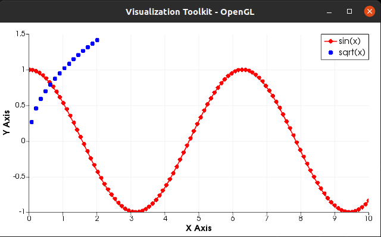
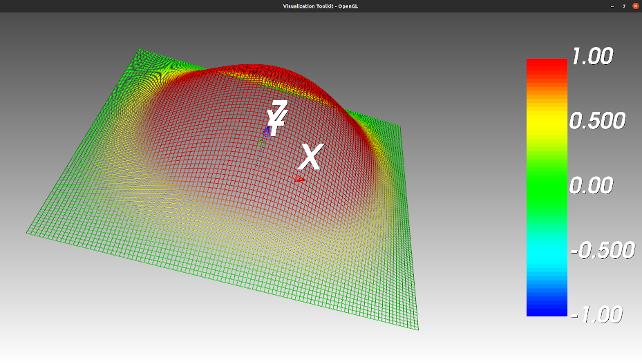
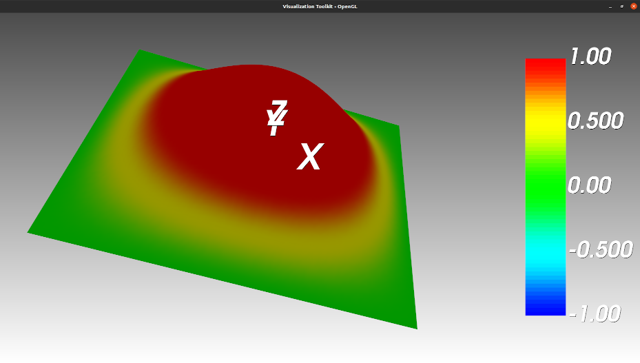
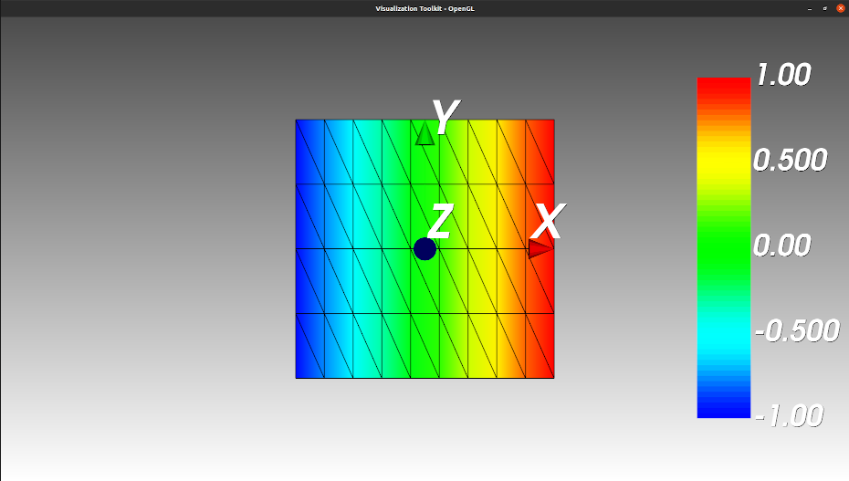
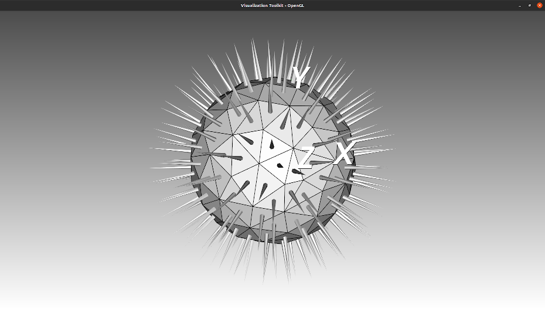

.. role:: red

.. _label-graphics-advanced:

Plotting and much more
======================

We describe here some aspects of the **graphics** library available within the **castor** project. It is based on the well-known `VTK library <https://www.vtk.org>`_ which must be installed by the user. Depending on the operating system, binary files *may* be directly available. However, one should pay attention to the fact that it is only compatible with version 9.x. 

After installing VTK (see :ref:`label-installation`), the user only needs to include the ``castor/graphics.hpp`` header file.

The path is very close to the one chosen by `Matlab <https://www.mathworks.com/products/matlab.html>`_ or `Matplotlib <https://matplotlib.org/>`_ (for the Python language). First, the user creates a ``figure`` which is a container which will hold the plots. Then,he adds one or multiple plots to the ``figure``. Finally, he asks the system to display the figures (one window per ``figure`` will be created) with the ``drawnow(...)`` function. Each call to ``drawnow`` displays **all** the ``figure`` objects which have been defined since the last call.

.. warning::
    Each call to ``drawnow`` is **blocking**, meaning that it will suspend the execution of the program until all the opened ``figure`` are closed. 
    This behavior cannot be modified as it is due to VTK.

    On Windows and linux, when the opened ``figure`` are closed, the program stops. A workaround consists in to call the `drawnow`` function at the end 
    of the program.

The **graphics** library features 2D/3D customizable plotting and basic triangular/tetrahedral mesh generation. We detail the use of some of these features below. The demo files may be found in the ``demo/demo_graphics/`` subfolder.

It is possible to **interact with the figures** in multiple ways:

 - "right-click and hold" : *rotate the content* in the direction of the mouse-pointer for **3D** figures. For **2D** plots, the user can use it to drag the plots in the direction of choice.

 - "middle-click and hold": *translate the content* in the direction of the mouse-pointer.

 - "left-click and hold": *zoom-in* if the pointer is in the upper window, otherwise *zoom-out*.

 - "key-pressed **e** or **q**": close window. **Warning:** in some systems, it closes *all* windows.

 - "key-pressed **r**": resets the view.

 - "key-pressed **w**": switches to *wireframe* view when applicable.

 - "key-pressed **s**": switches to *surface* view when applicable.

We advise the user to experiment with the different features mentioned above. The summary of all the available functions is available at :ref:`label-basic-plot`, :ref:`label-graphical-io`, :ref:`label-graphical-tools`, :ref:`label-mesh-management` and :ref:`label-mesh-plot`.

Basic 2D plotting
-----------------

In this example, we will plot a *sine* and a *square root* function with different styles but on the same display. First, we initialize some data and we create a ``figure`` object. The full code is available at ``demo/demo_graphics/basic.cpp``.

.. code:: c++

    matrix<> X = linspace(0,10,100);
    matrix<> Y = cos(X);
    figure fig;

Then, we add our first plot as a red solid line with diamond markers with the correct legend.

.. code:: c++

    plot(fig,X,Y,{"r-d"},{"sin(x)"});

Now we create a second set of data, reusing the already-defined variables. This is possible because the inputs are copied. This time, we plot it as a simple dotted blue line.

.. code:: c++

    X = linspace(-2,2,30);
    Y = sqrt(X);
    plot(fig,X,Y,{"b"},{"sqrt(x)"});
    // display
    drawnow(fig);

The figure should look like this:

**Remark:** Currently, it is not possible to save the output to a graphic file.

Surface plot
------------

Surface plotting consists in plotting a surface defined by the equation ``Z = f(X,Y)``. First we create the *grid* (X,Y). The full code is available at ``demo/demo_graphics/surface_plot.cpp``.

.. code:: c++

    matrix<> X,Y;
    std::tie(X,Y) = meshgrid(linspace(-M_PI,M_PI,100));

Then, we create the surface which we want to plot, create a ``figure``, adjust the color axis and display everything.

.. code:: c++

    matrix<> Z = 2*sin(X)/X * sin(Y)/Y;
    // create the figure
    figure fig;
    caxis(fig,{-1,1}); // scaled color in the range [-1,1]
    mesh(fig,X,Y,Z);
    // display
    drawnow(fig);

The result is a 3-dimensional plot which should look like this : 

**TIP:** It is possible to switch to a full *surface* plot by pressing the **s** key and switch back to a *wireframe* display by pressing the **w** key.

Displaying nodal values
-----------------------

This feature is particularly useful if, for example, one needs to display the result of a finite element computation where the data is known at the vertices. In the following example, we create a planar mesh with triangular elements. Then we define a linearly increasing nodal data along the *x*-axis. The full code is available at ``demo/demo_graphics/nodal_values.cpp``.

.. code:: c++

    // geometric data
    matrix<> X,Y;
    std::tie(X,Y) = meshgrid(linspace(-1,1,10),linspace(-1,1,5));
    X = vertcat(X,X); 
    Y = vertcat(Y,Y);
    matrix<> Z = zeros(size(X));

    // create mesh
    matrix<> vtx;
    matrix<std::size_t> elt;
    std::tie(elt,vtx) = tridelaunay(X,Y,Z);

    // display
    figure fig;
    trimesh(fig,elt,vtx,eval(vtx(row(vtx),0)));
    drawnow(fig);

The result should look like this:

From mesh generation to file output
-----------------------------------

In this example, we create a spherical mesh and compute the normals to the triangles. We plot both on the same figure. Finally, we save the mesh to a *.ply* file. We also illustrate the use of the :ref:`label-quiver` function. The full code is available at ``demo/demo_graphics/advanced_mesh.cpp``.

First, we create the mesh using the :ref:`label-sphere2` function which creates a Fibonacci sphere.

.. code:: c++

    std::size_t nvtx=100;
    // 1. Create the mesh
    matrix<> vtx;
    matrix<std::size_t> elt;
    
    matrix<> X,Y,Z;
    std::tie(X,Y,Z) = sphere2(nvtx); // Fibonacci sphere
    // Delaunay tetrahedrisation
    std::tie(elt,vtx) = tetdelaunay(X,Y,Z);
    // Boundary extraction
    std::tie(elt,vtx) = tetboundary(elt,vtx);

Then, we compute the center ``ctr`` of the triangles and the normal vector ``nrm``. We recall that the coordinates of ``ctr`` are simply the averaged sum of the coordinates of the vertices of the triangles. The coordinates of ``nrm`` may be determined by computing the cross-product between the tangent of, two consecutive edges. In this example we normalize the length to 0.25 to get an equilibrated display.

.. code:: c++

    // 2. Compute the normal vectors and the centers of the triangles
    std::size_t nelt = size(elt,1);
    matrix<> nrm = zeros(nelt,3);
    matrix<> ctr = zeros(nelt,3);
    for(std::size_t ie=0; ie<nelt; ++ie)
    {
        // center
        for(std::size_t i=0; i<3; ++i)
        {
            ctr(ie,i) = (vtx(elt(ie,0),i)+vtx(elt(ie,1),i)+vtx(elt(ie,2),i))/3.;
        }
        // normal vector to triangle {A,B,C}
        matrix<> AB=zeros(1,3), BC=zeros(1,3), nv = zeros(1,3);
        for(std::size_t i=0; i<3; ++i)
        {
            // tangent to first edge
            AB(i) = vtx(elt(ie,1),i) - vtx(elt(ie,0),i);
            tangent to second edge
            BC(i) = vtx(elt(ie,2),i) - vtx(elt(ie,1),i);
        }
        // for single vectors, this code is faster than
        // a call to 'cross' (for the cross-product) or 'norm'.
        nv(0) = AB(1)*BC(2) - AB(2)*BC(1);
        nv(1) = AB(2)*BC(0) - AB(0)*BC(2);
        nv(2) = AB(0)*BC(1) - AB(1)*BC(0);
        double l = std::sqrt(nv(0)*nv(0)+nv(1)*nv(1)+nv(2)*nv(2));
        // normalization
        for(std::size_t i=0; i<3; ++i) 
        {
            nrm(ie,i) = nv(i)/(2*l); // arrows of length 0.5
        }
    }

Now, we plot the result.

.. code:: c++

    // 3. Plot everything
    figure fig;
    trimesh(fig,elt,vtx); // plot the mesh
    quiver(fig,ctr,nrm);  // plot the normal vectors at the centers
    drawnow(fig);

Finally, save the mesh into the current directory in the *.ply* format.

.. code:: c++

    // 4. save to .ply
    std::string path="./", name="testfile.ply";
    triwrite(path,name,elt,vtx);

The result should look like an urchin, see below. **Please note that the normal vectors may not appear when the window appears. In that case, simply clicking inside the window should do the trick.**

