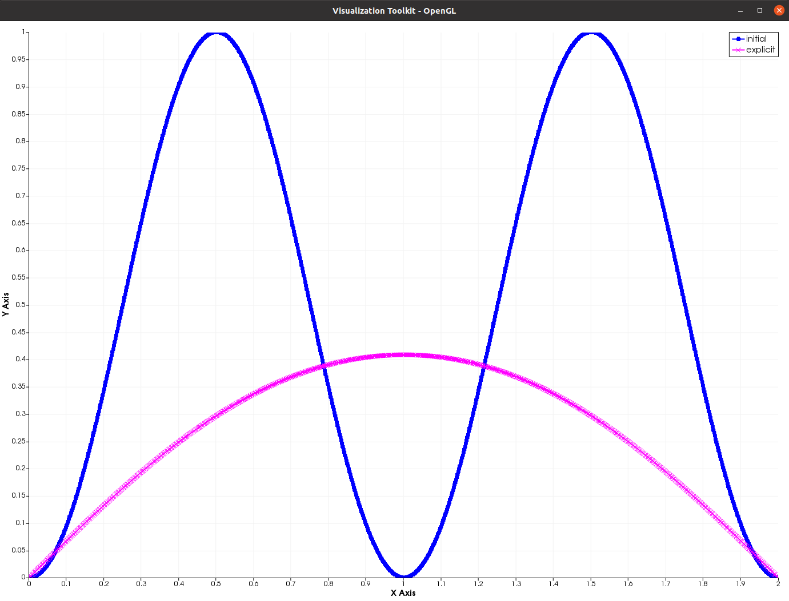
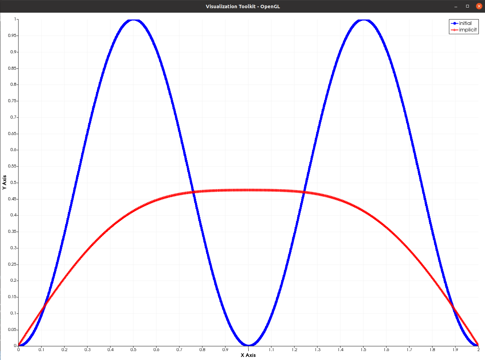

Heat equation
=============

*Shared by Antoine Rideau*

On this page you will find how to code using **Castor** an example as simple as heat diffusion in 1 dimension without heat source with Dirichlet boundary described by the following equation :

.. math:: 
    
    \left\{ \begin{matrix} \displaystyle \frac{\partial u }{\partial t} = d \frac{\partial^2 u}{\partial x^2} 
    \\ u(x_{min},t) = u(x_{max}, t) = 0 
    \\ u(x,0) = \sin(x\pi )^{2}  \end{matrix} \right.

The simulation is focuses on the interval :math:`\left [ x_{min}, x_{max}\right ]=\left [ 0,2 \right ]` for the space domain which is divided between ``Nx = 1000`` points .

.. code-block:: c++
    
    //Parameters
    int Nx = 1000;
    double xmin = 0;
    double xmax = 1;
    double tf = 0.1;
    double ti = 0;

    
The space is discretized with ``dx`` steps and the time with ``dt`` steps. 

.. math:: 

    \begin{matrix} x_{i} = i \Delta x \\ t_{n} = n \Delta t \end{matrix}

The ``X`` vector stores the space grid

.. math:: 
    
    X = \begin{pmatrix} x_{0}\\ x_{1} \\ \vdots \\ x_{N_{x}-1} \end{pmatrix} ,

and the vector ``U0`` contains the initial heat repartition 

.. math:: 

    U_{0} = \begin{pmatrix} u_{0}^{0} \\ u_{1}^{0} \\ \vdots \\ u_{N_{x}-1}^{0} \end{pmatrix} \text{ with } u_{i}^{0} = \sin(x_{i})^{2} \text{ for } i=0,...,N_{x} .

.. code-block:: c++

    //Discretization
    double dx = (xmax - xmin) / (Nx - 1);
    double dt = 0.5 * (dx * dx) / d;
    matrix<> X = linspace(xmin, xmax, Nx);
    matrix<> U0 = pow(sin(X * M_PI), 2);

The second space derivative is approximated by :

.. math:: 

    \frac{\partial^2 u_{i}^{n}}{\partial x^2}\approx \frac{u_{i+1}^{n}-2u_{i}^{n}+u_{i-1}^{n}}{\Delta x^{2}} 

.. Analytical solution
.. -------------------

.. With those parameters, the analytical solution is :

.. .. math::

..     \text{ MATHS }

Explicit Euler
--------------

The specifity of the explicit Euler scheme is that the time derivative is calculated with the forward differential quotient approximation

.. math::

    \frac{\partial u_{i}^{n}}{\partial t}\approx \frac{u_{i}^{n+1}-u_{i}^{n}}{\Delta t}

So as to maintain the stability of the simulation, the time step ``dt`` has to respect the following inequality

.. math:: 

    d \frac{\Delta t}{\Delta x^{2}} \leq \frac{1}{2}

Finally, the following numerical scheme is obtained :

.. math:: 

    \frac{u_{i}^{n+1}-u_{i}^{n}}{\Delta t}- d \frac{u_{i+1}^{n}-2u_{i}^{n}+u_{i-1}^{n}}{\Delta x^{2}}=0 

When coming to the code, :math:`u_{i}^{n+1}` is expressed in function of the other dependencies of :math:`u` :

.. math:: 
    
    u_{i}^{n+1} = u_{i}^{n} + \alpha (u_{i+1}^{n}-2u_{i}^{n}+u_{i-1}^{n}) \text{ with } \alpha= \frac{d \Delta t}{\Delta x^{2}}

.. code-block:: c++

    double alpha = (dt * d / (dx * dx));
    for (double t = 0; t <= tend; t += dt)
    {
        for (int i = 1; i < Nx - 1; i++)
        {
            U(i) += alpha * (U(i - 1) - 2 * U(i) + U(i + 1));
        }
    }

Here you have all the code at once :

.. code-block:: c++

    #include "castor/matrix.hpp"
    #include "castor/graphics.hpp"

    using namespace castor;

    int main(int argc, char *argv[])
    {
        //Thermal diffusivity
        double d = 1.;

        //Parameters
        int Nx = 1000;
        double xmin = 0;
        double xmax = 2;
        double tend = 0.1;
        double ti = 0;

        //Discretization
        double dx = (xmax - xmin) / (Nx - 1);
        double dt = 0.5 * (dx * dx) / d;
        double alpha = (dt * d / (dx * dx));
        matrix<> X = linspace(xmin, xmax, Nx);
        matrix<> U0 = pow(sin(X * M_PI), 2);

        std::cout << "--- Start explicit Euler scheme ---" << endl;
        tic();
        auto U = U0;
        for (double t = 0; t <= tend; t += dt)
        {
            for (int i = 1; i < Nx - 1; i++)
            {
                U(i) += alpha * (U(i - 1) - 2 * U(i) + U(i + 1));
            }
        }
        toc();

        //Plot
        figure fig;
        plot(fig, X, U0, {"b-o"}, {"initial"});
        plot(fig, X, S, {"g-s"}, {"solution"});
        plot(fig, X, U, {"m-x"}, {"explicit"});
        drawnow(fig);

        return 0;
    }

With this code you should get these outputs :

.. code-block:: text

    --- Start explicit Euler scheme ---
    Elapsed time is 0.213486 seconds.

Implicit Euler
--------------

The specifity of the implicit Euler scheme is that the time derivative is calculated with the backward differential quotient approximation

.. math::
    
    \frac{\partial u_{i}^{n}}{\partial t} \approx \frac{u_{i}^{n}-u_{i}^{n-1}}{\Delta t}

| This scheme is stable for any ``dt`` .
| The scheme can be written using vectors

.. math:: 

    \frac{U^{n+1}-U^{n}}{\Delta t} + \frac{d}{\Delta x}AU^{n+1} = 0 ,

where A is the :math:`N_{x}` x :math:`N_{x}` tridiagonal matrix 

.. math:: 

    A = \begin{pmatrix} -2 & 1 & 0 & \cdots  & 0 
    \\ 1 & -2 & 1 & \cdots  & 0 
    \\ \vdots & \ddots  & \ddots  & \ddots  & \vdots 
    \\ 0 & \cdots  & 1 & -2 & 1 
    \\ 0 & \cdots  & 0 & 1 & -2 \end{pmatrix} .
    

This equation leads to the following linear equation 

.. math::
    
    BU^{n+1} = U^{n} \text{ with } B = (I_{N_{x}} - \alpha A) .

.. code-block:: c++

    double alpha = (dt * d / (dx * dx));
    matrix<> e = ones(Nx, 1);
    smatrix<> A = spdiags(cat(2, cat(2, e, -2 * e), e), colon(-1, 1), Nx, Nx);
    auto B = speye(Nx) - alpha * A;
    for (double t = 0; t <= tend; t += dt)
    {
        U = linsolve(B, U);
    }

Here you have all the code at once :

.. code-block:: c++

    #include "castor/matrix.hpp"
    #include "castor/graphics.hpp"
    #include "castor/linalg.hpp"

    using namespace castor;

    int main(int argc, char *argv[])
    {
        //Thermal diffusivity
        double d = 1.;

        //Parameters
        int Nx = 1000;
        double xmin = 0;
        double xmax = 2;
        double tend = 0.1;
        double ti = 0;

        //Discretization
        double dx = (xmax - xmin) / (Nx - 1);
        double dt = 5 * (dx * dx) / d;
        double alpha = (dt * d / (dx * dx));
        matrix<> X = linspace(xmin, xmax, Nx);
        matrix<> U0 = pow(sin(X * M_PI), 2);

        std::cout << "--- Start implicit Euler scheme ---" << endl;
        auto U = transpose(U0);
        tic();
        matrix<> e = ones(Nx, 1);
        smatrix<> A = spdiags(cat(2, cat(2, e, -2 * e), e), colon(-1, 1), Nx, Nx);
        auto B = speye(Nx) - alpha * A;
        for (double t = 0; t <= tend; t += dt)
        {
            U = linsolve(B, U);
        }
        toc();

        U = transpose(U);

        //Plot
        figure fig;
        plot(fig, X, U0, {"b-o"}, {"initial"});
        plot(fig, X, S, {"g-s"}, {"solution"});
        plot(fig, X, U, {"r-+"}, {"implicit"});
        drawnow(fig);

        return 0;
    }

With this code you should get these results :

.. code-block:: text

    --- Start implicit Euler scheme ---
    Elapsed time is 4.11192 seconds.

References
----------

https://www.ljll.math.upmc.fr/ledret/M1English/M1ApproxPDE_Chapter6-2.pdf