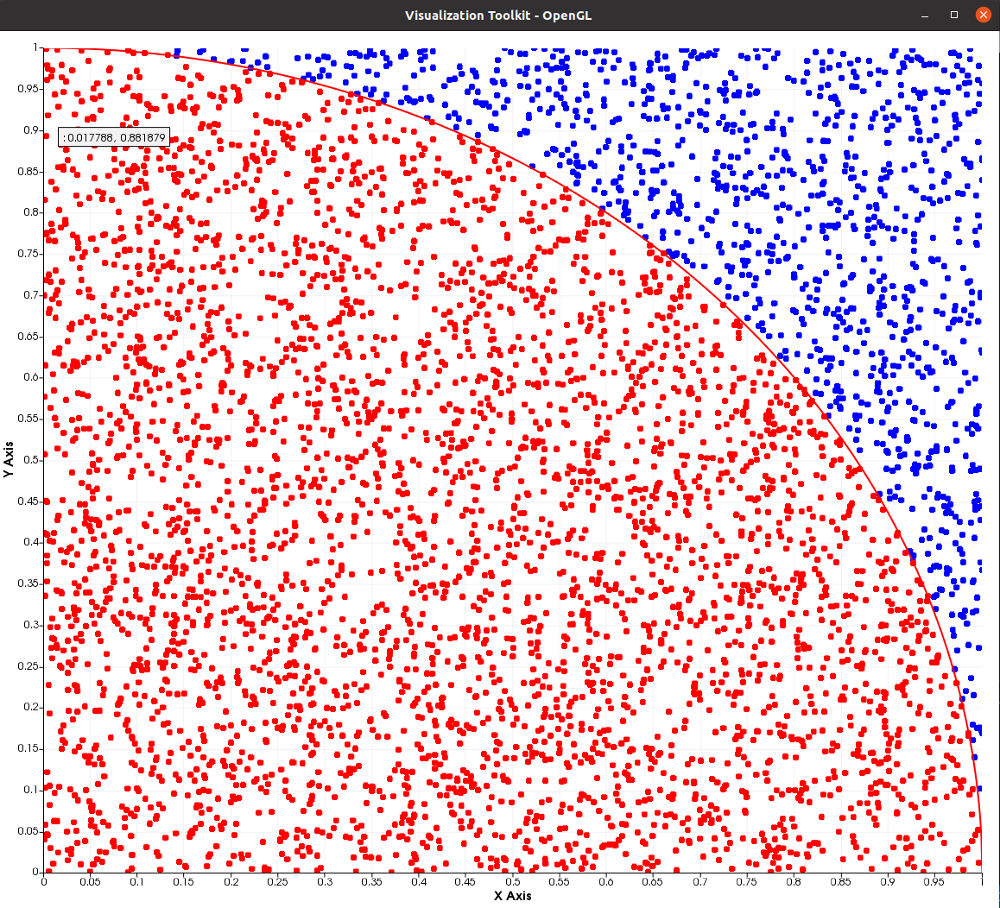

Monte Carlo method
==================
*Shared by Antoine Rideau*

On this page you will find how to calculate using **Castor** the value of :math:`\pi` with Monte Carlo method.

Monte Carlo methods are a broad class of computational algorithms that rely on repeated random sampling to obtain numerical results.
The underlying concept is to use randomness to solve problems that might be deterministic in principle.
They are mainly used in physical and mathematical problems related to optimization, numerical integration, and generating draws from a probability distribution.

First, draw 1 by 1 square and inscribe a quadrant within it.

Then ``n`` points are scattered randomly  with :math:`(x,y)` coordinate over the square.

.. code-block:: c++

    // Parameters
    double n = 5000.; //Number of points
    auto MX = rand(1, n); 
    auto MY = rand(1, n);

As the quadrant's surface is equal to

.. math::

    \sigma = \frac{R^2 \pi}{4} = \frac{\pi}{4} \text{ as } R = 1 ,

and the square's surface is 

.. math::

    S = R^2 = 1 ,

the probability to be in the quadrant is

.. math::

    \mathbb{P} = \frac{N_{in}}{n} = \frac{\sigma}{S} = \frac{\pi}{4} ,

| with :math:`N_{in}` number of points inside the quadrant.
| Hence,

.. math::

    \pi = 4 * \frac{N_{in}}{n} .

So, points inside the quadrant i.e points with :math:`x^2 + y^2 \leq 1` are counted.

.. code-block:: c++
    
    // Pi computation
    matrix<std::size_t> Incircle;
    Incircle = find(pow(MX, 2) + pow(MY, 2) <= 1);
    double Pi = 4. * (numel(Incircle) / n);

See :ref:`label-find-smatrix` , :ref:`label-numel` 

Another way of doing it is by using ``sum``

.. code-block:: c++

    size_t Nin = sum<size_t>(pow(MX, 2) + pow(MY, 2) <= 1);
    double Pi = 4. * (Nin / n);

See :ref:`label-sum`

Code
----

.. code-block:: c++

    #include "castor/matrix.hpp"
    #include "castor/graphics.hpp"

    using namespace castor;

    int main(int argc, char const *argv[])
    {

        // Parameters
        double n = 5000.; //Number of points
        auto MX = rand(1, n);
        auto MY = rand(1, n);

        // Pi computation
        matrix<std::size_t> Incircle;
        Incircle = find(pow(MX, 2) + pow(MY, 2) <= 1);
        double Pi = 4. * (numel(Incircle) / n);
        std::cout << "Calculated value of pi: " << Pi << endl;

        // Visu
        auto X = linspace(0, 1, 1000);
        auto Y = sqrt(1 - pow(X, 2));
        figure fig;
        plot(fig, MX, MY, {"b"});
        plot(fig, eval(MX(Incircle)), eval(MY(Incircle)), {"r"});
        plot(fig, X, Y, {"r-"});
        drawnow(fig);

        return 0;
    }

With this code you should get these outputs :

.. code-block:: text

    Calculated value of pi: 3.148

References
----------

https://en.wikipedia.org/wiki/Monte_Carlo_method