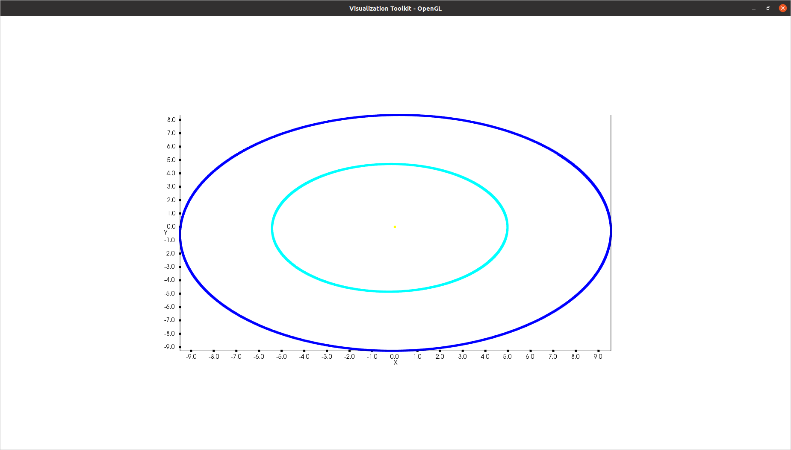

N-body problem
==============

*Shared by Antoine Rideau*

| On this page you will find how to simulate using **Castor** the n-body problem with 3 celestial bodies : the Sun, Jupiter and Saturn.
|
| In physics, the n-body problem is the problem of predicting the individual motions of a group of celestial objects interacting with each other gravitationally.
|
| First of all,  Newton's law of gravity says that the gravitational force felt on a planet *P* by the Sun *S* is given by

.. math::

    \overrightarrow{F}_{S\rightarrow P} = - \overrightarrow{F}_{P\rightarrow S} = -\frac{Gm_{S}m_{P}}{d^2}\overrightarrow{u} ,

| where :
|    :math:`G` : gravitational constant,
|    :math:`m_{S}`, :math:`m_{P}` : masses of the Sun and the planet,
|    :math:`d` : distance between the Sun and the planet,
|    :math:`\overrightarrow{u}` : monic vector directed from the Sun to the planet.
|
| The system is composed of the three heavier bodies in the solar system : the Sun, Jupiter and Saturn which will be referred as *S*, *Ju* and *Sa*. This system is supposed isolated and only gravitational forces are applied on the three celestial bodies.
| According to Newton's second principle, with :math:`m` the masses, :math:`\overrightarrow{a}` the acceleration and :math:`\overrightarrow{F}` the forces :

.. math::

    \begin{matrix}
    m_{Ju}\overrightarrow{a}_{Ju} = \overrightarrow{F}_{S\rightarrow Ju}  + \overrightarrow{F}_{Sa\rightarrow Ju} ,
    \\ 
    m_{Sa}\overrightarrow{a}_{Sa} = \overrightarrow{F}_{S\rightarrow Sa}  + \overrightarrow{F}_{Ju\rightarrow Sa} ,
    \\ 
    m_{S}\overrightarrow{a}_{S} = \overrightarrow{F}_{Ju\rightarrow S}  + \overrightarrow{F}_{Sa\rightarrow S} .
    \end{matrix}

+------------+----------------------------------------------------------------+
|   Bodies   |  Masses                                                        |
|            |  (relatively to the Sun)                                       |
+======================+======================================================+
| Sun and inner planet | :math:`m_{0}` = 1.00000597682                        |
+----------------------+------------+-----------------------------------------+
|        Jupiter       | :math:`m_{1}` = 0.000954786104043                    |
+----------------------+------------+-----------------------------------------+
|        Saturn        | :math:`m_{2}` = 0.000285583733151                    |
+----------------------+------------+-----------------------------------------+
| Gravitational constant :math:`G = 2.95912208286 \times 10^{-4}`             |
+-----------------------------------------------------------------------------+

.. code-block:: c++

    // Parameters
    matrix<> m = {{1.00000597682}, {9.54786104043e-4}, {2.85583733151e-4}}; // Masses : Sun, Jupiter and Saturn
    double G = 2.95912208286e-4;                                            //Gravitation's constant

The position of a object over time is given by :math:`q(t)`.

+------------+-----------------------------+
|   Bodies   |    Initial position (AU)    |
+============+=============================+
|            |               0             |
|            +-----------------------------+
|     Sun    |               0             |
|            +-----------------------------+
|            |               0             |
+------------+-----------------------------+
|            |          −3.5023653         |
|            +-----------------------------+
|  Jupiter   |          −3.8169847         |
|            +-----------------------------+
|            |          −1.5507963         |
+------------+-----------------------------+
|            |           9.0755314         |
|            +-----------------------------+
| Saturn     |          −3.0458353         |
|            +-----------------------------+
|            |          −1.6483708         |
+------------+-----------------------------+

where AU stands for astronomical unit and :math:`1 AU = 1.495 978 707 \times 10^{11}` m.

.. code-block:: c++
    
    matrix<> qini = {0, 0, 0,                               // Sun's initial position
                    -3.5023653, -3.8169847, -1.5507963,     // Jupiter's initial position
                    9.0755314, -3.0458353, -1.6483708};     // Saturn's initial position

| Moreover, using the momentum :math:`\overrightarrow{p} = m\overrightarrow{v} = m\overrightarrow{\dot{q}}(t)` instead of the speed is more practical. 
| Indeed, the system's total momentum is preserved over time :

.. math::

    \overrightarrow{p}_{S}(t) + \overrightarrow{p}_{Ju}(t) + \overrightarrow{p}_{Sa}(t) = Constant

+------------+-----------------------------+
|   Bodies   | Initial velocity (AU/day)   |
+============+=============================+
|            |               0             |
|            +-----------------------------+
|     Sun    |               0             |
|            +-----------------------------+
|            |               0             |
+------------+-----------------------------+
|            |           0.00565429        |
|            +-----------------------------+
|  Jupiter   |           0.00565429        |
|            +-----------------------------+
|            |          −0.00190589        |
+------------+-----------------------------+
|            |           0.00168318        |
|            +-----------------------------+
| Saturn     |           0.00483525        |
|            +-----------------------------+
|            |           0.00192462        |
+------------+-----------------------------+

.. code-block:: c++

    matrix<> vini = {0, 0, 0,                                                                   // Sun's initial velocity
    0.00565429, -0.00412490, -0.00190589,                                                       // Jupiter's initial velocity
    0.00168318, 0.00483525, 0.00192462};                                                        // Saturn's initial velocity
    matrix<> pini = reshape(mtimes(transpose(m), ones(1, numel(m))), 1, numel(vini)) * vini;    // Initial momentums

See :ref:`label-reshape` , :ref:`label-mtimes`, :ref:`label-transpose`, :ref:`label-ones`, :ref:`label-numel`.

Time is discretized into ``nt`` steps 

.. math::

    t_{i} = it \times \delta t \text{ for } it = \left [ \! \left [ 0, nt-1 \right ] \! \right ]

.. code-block:: c++

    // Disretization
    int nt = 1501;
    double dt = (tend - tini) / (nt - 1);
    auto T = linspace(tini, tend, nt);

See :ref:`label-linspace`.

Scheme
------

| A symplectic Euler scheme is used in this simulation because it preserved the energy of the system unlike either forward and backward Euler scheme.
| 
| As the system is conservative the Hamiltonian can be separated in a cinetical part :math:`K(p)` and a potential part :math:`V(q)` :

.. math::

    H(q,p) = K(p) + V(q) ,

where

.. math::

    \begin{matrix}
    \displaystyle K(p) = \frac{1}{2}\frac{p^2}{m}
    & \text{ and } &
    \displaystyle V(q_{i}) = \sum_{j\neq i}- \frac{Gm_{j}m_{i}}{\left | q_{i}-q_{j} \right |} .
    \end{matrix}

With such a separation, Hamilton equation are given by 

.. math::

    \begin{matrix}
    \displaystyle \frac{\mathrm{d} q}{\mathrm{d} t} = + \frac{\mathrm{d} K}{\mathrm{d} p}
    & \text{ and } &
    \displaystyle \frac{\mathrm{d} p}{\mathrm{d} t} = - \frac{\mathrm{d} V}{\mathrm{d} q} ,
    \end{matrix}

where

.. math::

    \begin{matrix}
    \displaystyle \frac{\mathrm{d} K(p)}{\mathrm{d} p} = \frac{p}{m}
    & \text{ and } &
    \displaystyle \frac{\mathrm{d} V(q_{i})}{\mathrm{d} q} = \sum_{j\neq i} \frac{Gm_{j}m_{i}\left ( q_{i}-q_{j} \right )}{\left | q_{i}-q_{j} \right |^3}
    \end{matrix}

which result to the symplectic Euler scheme :

.. math::

    \begin{matrix}
    \displaystyle q_{n+1} = q_{n} + \frac{\mathrm{d} K}{\mathrm{d} p}(p_{n})
    & \text{ and } &
    \displaystyle p_{n+1} = p_{n} - \frac{\mathrm{d} V}{\mathrm{d} q}(q_{n+1})
    \end{matrix}

.. code-block:: c++

    // Scheme
    auto Q = zeros(nt, numel(qini));
    Q(0, col(Q)) = qini;
    auto P = zeros(nt, numel(pini));
    P(0, col(P)) = pini;
    // Symplectic Euler
    for (int it = 0; it < nt - 1; it++)
    {
        matrix<> q_n = eval(Q(it, col(Q)));
        matrix<> p_n = eval(P(it, col(P)));
        Q(it + 1, col(Q)) = q_n + dt * H_p(G, m, p_n);
        P(it + 1, col(P)) = p_n - dt * H_q(G, m, eval(Q(it + 1, col(Q))));
    }

See :ref:`label-zeros`, :ref:`label-numel`, :ref:`label-col` , :ref:`label-view`.

In the code, :math:`\displaystyle \frac{\mathrm{d} K}{\mathrm{d} p}(p)` is represented by the function ``H_p`` 

.. code-block:: c++

    matrix<> H_p(double G, matrix<> m, matrix<> p)
    {
        auto Hp = zeros(1, numel(p));
        m = reshape(mtimes(transpose(m), ones(1, numel(m))), 1, numel(p));
        Hp = p / m;
        return Hp;
    }

See :ref:`label-zeros`, :ref:`label-reshape` , :ref:`label-mtimes`, :ref:`label-transpose`, :ref:`label-ones`, :ref:`label-numel`.

and :math:`\displaystyle \frac{\mathrm{d} V}{\mathrm{d} q}(q)` by the function ``H_q``

.. code-block:: c++

    matrix<> H_q(double G, matrix<> m, matrix<> q)
    {
    
        auto q0 = eval(q(range(0, 3)));
        auto q1 = eval(q(range(3, 6)));
        auto q2 = eval(q(range(6, 9)));
        auto Hq = zeros(1, 9);
        Hq(range(0, 3)) = (G * m(0) * m(1) * ((q0 - q1) / pow(norm(q0 - q1), 3)) + G * m(0) * m(2) * ((q0 - q2) / pow(norm(q0 - q2), 3)));
        Hq(range(3, 6)) = (G * m(1) * m(0) * ((q1 - q0) / pow(norm(q1 - q0), 3)) + G * m(1) * m(2) * ((q1 - q2) / pow(norm(q1 - q2), 3)));
        Hq(range(6, 9)) = (G * m(2) * m(0) * ((q2 - q0) / pow(norm(q2 - q0), 3)) + G * m(2) * m(1) * ((q2 - q1) / pow(norm(q2 - q1), 3)));
        return Hq;
    }

See :ref:`label-range`, :ref:`label-view`, :ref:`label-zeros`, :ref:`label-norm`.

Visualisation
--------------

Simple figure with Castor
^^^^^^^^^^^^^^^^^^^^^^^^^

| The simplest method to visualize the results is to plot them using ``plot`` or ``plot3``, here ``plot3`` is used to show the motion in 3 dimensions.
| 
| For each coordinates x,y and z, the Sun's positions are subtracted in order to keep it still in the center.
| Moreover, ``transpose`` is needed because of matrix ``Q`` 's dimensions.

.. code-block:: c++

    // Visu
    figure fig;
    plot3(fig, transpose(eval(Q(row(Q), 3)) - eval(Q(row(Q), 0))), transpose(eval(Q(row(Q), 4)) - eval(Q(row(Q), 1))), transpose(eval(Q(row(Q), 5)) - eval(Q(row(Q), 2))), {"c"});
    plot3(fig, transpose(eval(Q(row(Q), 6)) - eval(Q(row(Q), 0))), transpose(eval(Q(row(Q), 7)) - eval(Q(row(Q), 1))), transpose(eval(Q(row(Q), 8)) - eval(Q(row(Q), 2))), {"b"});
    plot3(fig, zeros(1, nt), zeros(1, nt), zeros(1, nt), {"y"});

    
    Orbits of Jupiter (cyan) and Saturn (blue) around the Sun (yellow) in the center.

Video output with VTK
^^^^^^^^^^^^^^^^^^^^^

| A way to visualize the results through a video is by using C++ VTK video writer.
| However, C++ VTK video writer's behavior is very OS dependent, it works perfectly fine on MAC but can cause some issues on Linux. (Windows ?)
| 
| First of all, the source and the writer need to be initialized with name of the output file, quality, framerate and connnected together.

.. code-block:: c++

    // Initialize source and movie
    vtkNew<vtkWindowToImageFilter> source;
    vtkNew<vtkOggTheoraWriter> movie;
    movie->SetInputConnection(source->GetOutputPort());
    movie->SetFileName("nbody.avi");
    movie->SetQuality(2); // in [0,2]
    movie->SetRate(25);   // frame per seconds
    int Nplot = 150;      // < 200

Afterwards, the writer is initiated before the loop over time. 

.. code-block:: c++

    movie->Start();
    for (int it = 0; it < nt - 1; it++){...}

Then each wanted frame is plotted and added to the final movie.

.. code-block:: c++

    // Visu
    if (it % (nt / Nplot) == 0)
    {
        figure fig;
        matrix<> limits = {-10, 10};
        plot(fig, {Q(it, 3) - Q(it, 0)}, {Q(it, 4) - Q(it, 1)}, {"c"});
        plot(fig, {Q(it, 6) - Q(it, 0)}, {Q(it, 7) - Q(it, 1)}, {"b"});
        plot(fig, zeros(1), zeros(1), {"y"});
        xlim(fig, limits);
        ylim(fig, limits);
        source->SetInput(fig.GetView()->GetRenderWindow());
        source->SetInputBufferTypeToRGB();
        source->ReadFrontBufferOff();
        movie->Write();
    }

See :ref:`label-plot`, :ref:`label-xlim`, :ref:`label-ylim`.

Finally, the writer is closed after the loop over time.

.. code-block:: c++

    for (int it = 0; it < nt - 1; it++){...}
    movie->End();

.. raw:: html

    <video controls width="100%">

    <source src="./_static/3bodyvtk.mp4"
            type="video/mp4">

    Sorry, your browser doesn't support embedded videos.
    </video>

|                   Orbit of Jupiter (orange) and Saturn (green) around the Sun in the center.

Video animation with Python
^^^^^^^^^^^^^^^^^^^^^^^^^^^

| Another way to get an animation of the orbiting planets is to output our data, and then post processing those with Python. 
| To do so, first the positions in the matrix ``Q`` are stored in a .txt file using ``writetxt`` .
| So as to keep the Sun still in the center, its positions are subtracted of Jupiter's and Saturn's positions. 

.. code-block:: c++

    // Output
    writetxt("./", "dataJu.txt", cat(2, eval(Q(row(Q), 3)) - eval(Q(row(Q), 0)), eval(Q(row(Q), 4)) - eval(Q(row(Q), 1))));
    writetxt("./", "dataSa.txt", cat(2, eval(Q(row(Q), 6)) - eval(Q(row(Q), 0)), eval(Q(row(Q), 7)) - eval(Q(row(Q), 1))));

See :ref:`label-writetxt`, :ref:`label-row` .

Then the following Python code shows the beautiful animation.

.. code-block:: python

    import matplotlib.pyplot as plt
    import matplotlib.animation as animation
    import numpy as np
    from collections import deque

    # Data input
    dataJu = np.loadtxt("./build/dataJu.txt")
    dataSa = np.loadtxt("./build/dataSa.txt")

    # Parameters extraction
    nt = int(dataJu[0, 0])

    # Data processing
    dataJu = np.delete(dataJu, 0, 0)
    dataSa = np.delete(dataSa, 0, 0)

    # Visu initialization
    fig = plt.figure(figsize=(5, 4))
    ax = fig.add_subplot(autoscale_on=False, xlim=(-10, 10), ylim=(-10, 10))
    ax.set_aspect('equal')

    line, = ax.plot([], [], 'o', lw=2)
    traceJu, = ax.plot([], [], ',-', lw=1)
    traceSa, = ax.plot([], [], ',-', lw=1)
    historyJu_x, historyJu_y = deque(maxlen=nt), deque(maxlen=nt)
    historySa_x, historySa_y = deque(maxlen=nt), deque(maxlen=nt)

    def animate(i):
        # Get planets' current positions
        thisx = [0, dataJu[i, 0], dataSa[i, 0]]
        thisy = [0, dataJu[i, 1], dataSa[i, 1]]

        # Clear the trace when the animation loops
        if i == 0:
            historyJu_x.clear()
            historyJu_y.clear()
            historySa_x.clear()
            historySa_y.clear()

        # Add the current position to the trace
        historyJu_x.appendleft(thisx[1])
        historyJu_y.appendleft(thisy[1])
        historySa_x.appendleft(thisx[2])
        historySa_y.appendleft(thisy[2])

        line.set_data(thisx, thisy)  # Update planets' positions
        # Update planets' traces
        traceJu.set_data(historyJu_x, historyJu_y)
        traceSa.set_data(historySa_x, historySa_y)
        return line, traceJu, traceSa

    # Creating the Animation object
    ani = animation.FuncAnimation(
        fig, animate, nt, interval=10, blit=True)
    plt.show()

.. raw:: html

    <video controls width="100%">

    <source src="./_static/3body.mp4"
            type="video/mp4">

    Sorry, your browser doesn't support embedded videos.
    </video>

|                           Orbit of Jupiter (orange) and Saturn (green) around the Sun in the center.

Code
----

Here is all the code at once, without the functions ``H_q`` and ``H_p``  written above :

.. code-block:: c++

    #include "castor/matrix.hpp"
    #include "castor/graphics.hpp"
    #include "castor/linalg.hpp"

    using namespace castor;

        int main(int argc, char const *argv[])
    {
        // Parameters
        matrix<> m = {1.00000597682, 9.54786104043e-4, 2.85583733151e-4}; // Masses : Sun, Jupiter and Saturn
        double G = 2.95912208286e-4;                                      //Gravitation's constant

        matrix<> qini = {0, 0, 0,                                                                // Sun's initial position
                         -3.5023653, -3.8169847, -1.5507963,                                     // Jupiter's initial position
                         9.0755314, -3.0458353, -1.6483708};                                     // Saturn's initial position
        matrix<> vini = {0, 0, 0,                                                                // Sun's initial velocity
                         0.00565429, -0.00412490, -0.00190589,                                   // Jupiter's initial velocity
                         0.00168318, 0.00483525, 0.00192462};                                    // Saturn's initial velocity
        matrix<> pini = reshape(mtimes(transpose(m), ones(1, numel(m))), 1, numel(vini)) * vini; // Initial momentums

        double tini = 0.;
        double tend = 12500.;

        // Disretization
        int nt = 1501;
        double dt = (tend - tini) / (nt - 1);
        auto T = linspace(tini, tend, nt);

        // Initialize source and movie
        vtkNew<vtkWindowToImageFilter> source;
        vtkNew<vtkOggTheoraWriter> movie;
        movie->SetInputConnection(source->GetOutputPort());
        movie->SetFileName("nbody.avi");
        movie->SetQuality(2); // in [0,2]
        movie->SetRate(25);   // frame per seconds
        int Nplot = 150;      // < 200

        // Scheme
        auto Q = zeros(nt, numel(qini));
        Q(0, col(Q)) = qini;
        auto P = zeros(nt, numel(pini));
        P(0, col(P)) = pini;
        // Symplectic Euler
        tic();
        movie->Start();
        for (int it = 0; it < nt - 1; it++)
        {

            matrix<> q_n = eval(Q(it, col(Q)));
            matrix<> p_n = eval(P(it, col(P)));
            Q(it + 1, col(Q)) = q_n + dt * H_p(G, m, p_n);
            P(it + 1, col(P)) = p_n - dt * H_q(G, m, eval(Q(it + 1, col(Q))));

            // Visu
            if (it % (nt / Nplot) == 0)
            {
                figure fig;
                matrix<> L({-10, 10, -10, 10}); // Axis dimensions 
                plot(fig, Q(it, 3) - Q(it, 0) * ones(1), Q(it, 4) - Q(it, 1) * ones(1), L, {"c"});
                plot(fig, Q(it, 6) - Q(it, 0) * ones(1), Q(it, 7) - Q(it, 1) * ones(1), L, {"b"});
                plot(fig, zeros(1), zeros(1), {"y"});
                source->SetInput(fig.GetView()->GetRenderWindow());
                source->SetInputBufferTypeToRGB();
                source->ReadFrontBufferOff();
                movie->Write();
            }
        }
        movie->End();
        toc();

        // Output for Python post-processing and visualisation
        // writetxt("./", "dataJu.txt", cat(2, eval(Q(row(Q), 3)) - eval(Q(row(Q), 0)), eval(Q(row(Q), 4)) - eval(Q(row(Q), 1))));
        // writetxt("./", "dataSa.txt", cat(2, eval(Q(row(Q), 6)) - eval(Q(row(Q), 0)), eval(Q(row(Q), 7)) - eval(Q(row(Q), 1))));

        // Visu in native Castor
        // figure fig;
        // plot3(fig, transpose(eval(Q(row(Q), 3)) - eval(Q(row(Q), 0))), transpose(eval(Q(row(Q), 4)) - eval(Q(row(Q), 1))), transpose(eval(Q(row(Q), 5)) - eval(Q(row(Q), 2))), {"c"});
        // plot3(fig, transpose(eval(Q(row(Q), 6)) - eval(Q(row(Q), 0))), transpose(eval(Q(row(Q), 7)) - eval(Q(row(Q), 1))), transpose(eval(Q(row(Q), 8)) - eval(Q(row(Q), 2))), {"b"});
        // plot3(fig, zeros(1, nt), zeros(1, nt), zeros(1, nt), {"y"});

        // drawnow(fig);

        return 0;
    }

References
----------

| https://interstices.info/les-planetes-tournent-elles-rond/
|
| http://www.unige.ch/~hairer/poly/chap3.pdf