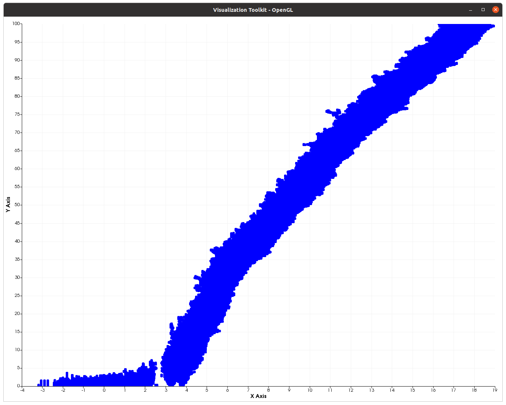

Replicator mutator Equation
===========================

*Shared by Antoine Rideau thanks to Gael Raoul*

On this page you will find how to simulate using **Castor** the replicator mutator equation

.. math:: 

    \partial_{t}u = \underbrace{\sigma \Delta_{x}u}_{mutations} + \underbrace{(x - \bar{x}(t))u}_{replication} \text{ , } t > 0, 

| where :
|    :math:`x \in \mathbb{R}` : a one dimension fitness space,
|    :math:`u(t,x)` : density of a population at time :math:`t` and per unit of fitness,
|    :math:`\bar{x}(t):= \int_{\mathbb{R}}xu(x,t)dx` : mean fitness at time :math:`t` .

The population is considered constant, so

.. math::

    \int_{\mathbb{R}}u(x,t)dx = 1 .

Numeric simulation
------------------

|   ``N`` individuals are gathered within the population, each characterized by their fitness :math:`x_{i}`.
|   Ths population will evolve during ``gmax`` generations separated by ``dt`` .

.. code-block:: c++

    // Parameters
    int N = 1e3;        // Population
    int gmax = 1e4;     // Number of generations
    int Nplot = 1000;     // Number of generations plotted
    double dt = 0.01;   // Time disretization
    double sigma = 0.5; // Mutation

Initially, the population is distributed following a Gaussian using ``randn`` .

.. code-block:: c++

    // Initial data
    auto parent = randn(1, N);

See :ref:`label-randn` . 

Each generation :

1. Each individuals has a probability :math:`\mathbb{P} = (x_{i})_{+} \times \Delta t` ,where :math:`(x_{i})_{+}` stands for the positive part of :math:`x_{i}` , to give birth to a child

.. code-block:: c++

    // Probablity to give birth
    auto birth = dt * maximum(parent, 0);

    // Reproduction
    auto reprod = rand(size(parent));  

See :ref:`label-maximum` , :ref:`label-rand` , :ref:`label-size` .

who will inherit a fitness of :math:`x_{i} + X` with :math:`X \sim \mathcal{N}(0, \sigma^2 \Delta t)` .

.. code-block:: c++

    // Children
    auto children = parent + sigma * std::sqrt(dt) * randn(1, N);
    children = eval(children(find(reprod < birth)));

    // Update parent
    parent = cat(2, parent, children);

See :ref:`label-find` , :ref:`label-view` , :ref:`label-cat` . 

2. ``N`` individuals are uniformly choosen  to survive.

.. code-block:: c++

    // Kill parent to get N individuals
    parent = eval(parent(randperm(numel(parent), N)));

See :ref:`label-randperm` , :ref:`label-numel` .

Code
----

.. code-block:: c++

    #include <castor/matrix.hpp>
    #include <castor/graphics.hpp>

    using namespace castor;

    int main(int argc, char const *argv[])
    {
        // Parameters
        int N = 1e3;        // Population
        int gmax = 1e4;     // Number of generations
        int Nplot = 1000;     // Number of generations plotted
        double dt = 0.01;   // Time disretization
        double sigma = 0.5; // Mutation

        // Initial data
        auto parent = randn(1, N);

        // Initialize figure
        figure fig;

        // For each generation
        tic();
        for (int g = 1; g <= gmax; g++)
        {
            // Probablity to give birth
            auto birth = dt * maximum(parent, 0);

            // Reproduction
            auto reprod = rand(size(parent));

            // Children
            auto children = parent + sigma * std::sqrt(dt) * randn(1, N);
            children = eval(children(find(reprod < birth)));

            // Update parent
            parent = cat(2, parent, children);

            // Kill parent to get N individuals
            parent = eval(parent(randperm(numel(parent), N)));

            // Plot
            if (g % (gmax / Nplot) == 0)
            {
                plot(fig, parent, g * dt * ones(size(parent)), {"b"});
            }
        }
        toc();

        // Visu
        drawnow(fig);
        return 0;
    }

    
    Fitness evolution of a 1 000 individuals' population during 10 000 generations.

Reference
---------

https://www.cirm-math.fr/RepRenc/1315/PDFfiles1315.pdf

